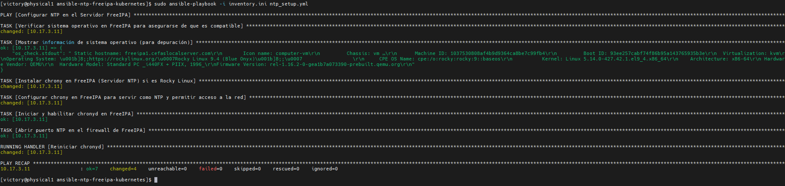

# Ansible NTP FreeIPA Kubernetes

Este repositorio proporciona una configuración automatizada para sincronizar el tiempo (NTP) dentro de un entorno de clúster Kubernetes utilizando Ansible. FreeIPA actúa como el servidor NTP central en el clúster para asegurar la sincronización horaria de manera precisa.

## Descripción del Proyecto

El objetivo de este proyecto es asegurar la sincronización horaria en un clúster Kubernetes. FreeIPA se configura como el servidor NTP y proporciona la hora oficial a otros nodos.

## Características

- **Configuración Automatizada del Servidor NTP**: Configura chrony en FreeIPA para los servicios de protocolo de tiempo de red (NTP).
- **Configuración del Firewall**: Abre los puertos necesarios para NTP en el servidor FreeIPA.
- **Fuentes NTP Personalizables**: Permite especificar servidores NTP preferidos en la configuración de chrony.

## Requisitos Previos

- **Ansible**: Asegúrate de tener Ansible instalado en el nodo de control.
- **Acceso SSH al Servidor FreeIPA**: El archivo de inventario debe configurarse con acceso SSH al nodo FreeIPA.
- **Rocky Linux**: Ambiente recomendado para el nodo FreeIPA, aunque debería ser compatible con otros sistemas.

## Configuración del Inventario

Crea un archivo de inventario (`inventory.ini`) para especificar tus nodos. A continuación, un ejemplo de formato:

```ini
[freeipa_servers]
10.17.3.11 ansible_user=core ansible_ssh_private_key_file=/root/.ssh/cluster_openshift/key_cluster_openshift/id_rsa_key_cluster_openshift ansible_port=22
```

## Resumen de Recursos para Máquinas Virtuales

| Nombre de VM | CPU | Memoria (MB) | IP         | Nombre de Dominio                | Tamaño de Disco (GB) | Hostname |
|--------------|-----|--------------|-----------|----------------------------------|-----------------------|----------|
| freeipa1     | 2   | 2048         | 10.17.3.11 | freeipa1.cefaslocalserver.com    | 32                    | freeipa1  |

## Uso

### Clonar el Repositorio

```bash
git clone https://github.com/yourusername/ansible-ntp-freeipa-kubernetes.git
cd ansible-ntp-freeipa-kubernetes
```

### Ejecutar el Playbook de Ansible

Ejecuta el playbook principal para configurar NTP en el servidor FreeIPA.

```bash
ansible-playbook -i inventory.ini ntp_setup.yml
```

### Verificar Sincronización

En el servidor FreeIPA, puedes verificar el estado de sincronización de la hora usando:

```bash
timedatectl status
```

## Estructura del Proyecto

- **`ntp_setup.yml`**: Playbook principal para configurar NTP en el servidor FreeIPA.
- **`templates/chrony.conf.j2`**: Plantilla para configurar chrony en el servidor FreeIPA.
- **`inventory.ini`**: Archivo de inventario de ejemplo (modifícalo según sea necesario para tu entorno).

## Detalles de Configuración

### FreeIPA (Servidor NTP)

- Instala y configura chrony para usar las fuentes NTP especificadas.
- Abre el puerto 123 en el firewall para la comunicación NTP.

## Solución de Problemas

Si surgen problemas de sincronización de tiempo, verifica lo siguiente:

- **Configuración del Firewall**: Asegúrate de que el puerto 123 esté abierto en el servidor FreeIPA.
- **Estado del Servicio**: Verifica que `chronyd` en el servidor FreeIPA esté en ejecución.
- **Conectividad de Red**: Confirma que todos los nodos puedan comunicarse con el servidor FreeIPA.

Usa los siguientes comandos para depurar:

```bash
# En el servidor FreeIPA
sudo chronyc sources -v

# Verificar el estado general de sincronización
timedatectl status
```

## Servidor NTP



## Cliente NTP nodo worker 1 Sincronizado con el servidor NTP


## Licencia

Este proyecto está licenciado bajo la Licencia MIT.

## Autor

Victor Galvez [https://github.com/vhgalvez](https://github.com/vhgalvez)