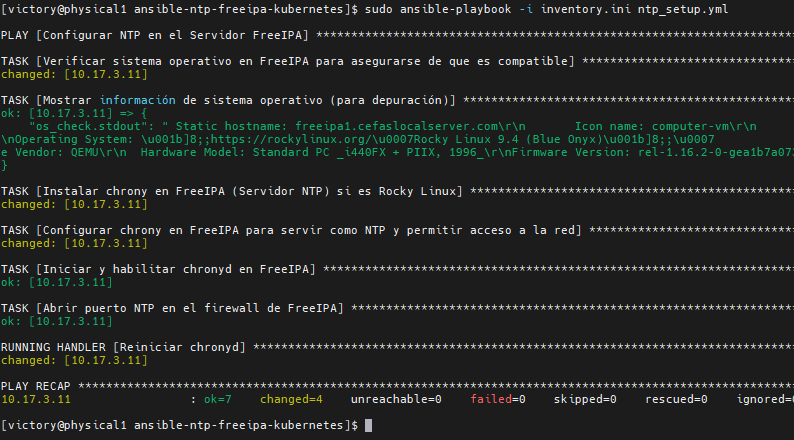
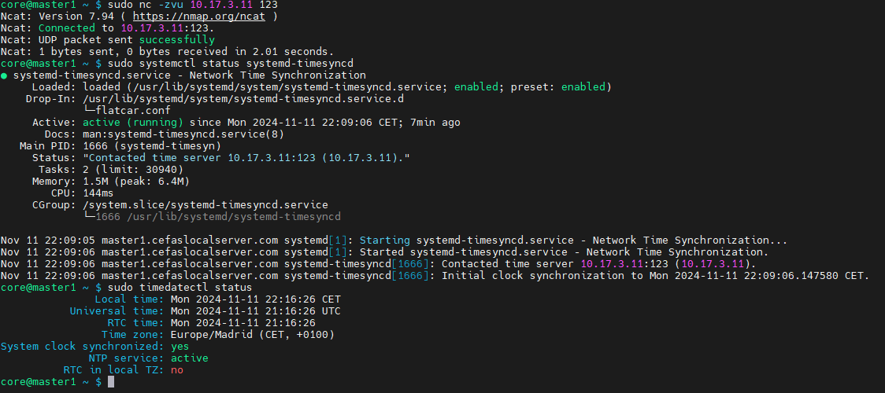

# Ansible NTP FreeIPA Kubernetes

Este repositorio proporciona una configuración automatizada para sincronizar el tiempo (NTP) dentro de un entorno de clúster Kubernetes utilizando Ansible. FreeIPA actúa como el servidor NTP central en el clúster para asegurar una sincronización horaria precisa.

## Descripción del Proyecto

El objetivo de este proyecto es asegurar la sincronización horaria en un clúster Kubernetes. FreeIPA se configura como el servidor NTP y proporciona la hora oficial a los demás nodos del clúster.

## Características

- **Configuración Automatizada del Servidor NTP**: Configura chrony en FreeIPA para los servicios de protocolo de tiempo de red (NTP).
- **Configuración del Firewall**: Abre los puertos necesarios para NTP en el servidor FreeIPA.
- **Fuentes NTP Personalizables**: Permite especificar servidores NTP preferidos en la configuración de chrony.

## Requisitos Previos

- **Ansible**: Asegúrate de tener Ansible instalado en el nodo de control.
- **Acceso SSH al Servidor FreeIPA**: El archivo de inventario debe configurarse con acceso SSH al nodo FreeIPA.
- **Rocky Linux**: Ambiente recomendado para el nodo FreeIPA, aunque debería ser compatible con otros sistemas.

## Configuración del Inventario

Crea un archivo de inventario (`inventory.ini`) para especificar tus nodos. A continuación, un ejemplo de formato:

```ini
[freeipa_servers]
10.17.3.11 ansible_user=core ansible_ssh_private_key_file=/root/.ssh/cluster_openshift/key_cluster_openshift/id_rsa_key_cluster_openshift ansible_port=22
```

## Resumen de Recursos para Máquinas Virtuales

| Nombre de VM | CPU | Memoria (MB) | IP         | Nombre de Dominio             | Tamaño de Disco (GB) | Hostname |
| ------------ | --- | ------------ | ---------- | ----------------------------- | -------------------- | -------- |
| freeipa1     | 2   | 2048         | 10.17.3.11 | freeipa1.cefaslocalserver.com | 32                   | freeipa1 |

## Uso

### Clonar el Repositorio

```bash
git clone https://github.com/yourusername/ansible-ntp-freeipa-kubernetes.git
cd ansible-ntp-freeipa-kubernetes
```

### Ejecutar el Playbook de Ansible

Ejecuta el playbook principal para configurar NTP en el servidor FreeIPA.

```bash
ansible-playbook -i inventory.ini ntp_setup.yml
```

### Verificar Sincronización

En el servidor FreeIPA, puedes verificar el estado de sincronización de la hora usando:

```bash
timedatectl status
```

## Estructura del Proyecto

- **`ntp_setup.yml`**: Playbook principal para configurar NTP en el servidor FreeIPA.
- **`templates/chrony.conf.j2`**: Plantilla para configurar chrony en el servidor FreeIPA.
- **`inventory.ini`**: Archivo de inventario de ejemplo (modifícalo según sea necesario para tu entorno).

## Detalles de Configuración

### FreeIPA (Servidor NTP)

- Instala y configura chrony para usar las fuentes NTP especificadas.
- Abre el puerto 123 en el firewall para la comunicación NTP.

## Solución de Problemas

Si surgen problemas de sincronización de tiempo, verifica lo siguiente:

- **Configuración del Firewall**: Asegúrate de que el puerto 123 esté abierto en el servidor FreeIPA.
- **Estado del Servicio**: Verifica que `chronyd` en el servidor FreeIPA esté en ejecución.
- **Conectividad de Red**: Confirma que todos los nodos puedan comunicarse con el servidor FreeIPA.


## Verificación en el Servidor NTP (FreeIPA)

Estos comandos aseguran que el servidor NTP esté configurado y operativo.

### Verificar la Configuración de Chrony

```bash
cat /etc/chrony.conf
```

Comprueba que la configuración tenga los servidores NTP correctos y la línea `allow 10.17.0.0/16` (o el rango de red adecuado) para permitir el acceso.

### Revisar el Estado del Servicio Chronyd

```bash
sudo systemctl status chronyd
```

Asegura que el servicio esté activo y en ejecución.

### Verificar el Estado de las Fuentes NTP

```bash
sudo chronyc sources -v
```

Muestra las fuentes NTP con detalles de su estado, exactitud y sincronización.

### Probar Conectividad del Puerto NTP (UDP 123)

```bash
sudo ss -uln | grep :123
```

Confirma que el puerto UDP 123 esté escuchando para recibir conexiones de clientes.

### Verificar Reglas del Firewall para NTP

```bash
sudo firewall-cmd --list-all | grep ntp
```

Confirma que el servicio NTP esté permitido en el firewall.

## Verificación en los Clientes (Nodos Kubernetes)

Estos comandos ayudan a asegurar que los clientes estén sincronizándose correctamente con el servidor NTP.

### Verificar la Conectividad con el Servidor NTP (UDP 123)

```bash
sudo nc -zvu <IP-del-servidor-NTP> 123
```

Asegúrate de que el cliente puede conectarse al puerto NTP del servidor.

### Comprobar el Estado de `systemd-timesyncd`

```bash
sudo systemctl status systemd-timesyncd
```

Verifica que el servicio esté en ejecución y esté contactando al servidor NTP.

### Verificar la Sincronización de la Hora con `timedatectl`

```bash
timedatectl status
```

Confirma que `System clock synchronized` esté en `yes` y que `NTP service` esté activo.

### Reiniciar `systemd-timesyncd` (si es necesario)

```bash
sudo systemctl restart systemd-timesyncd
```

Útil en caso de cambios en la configuración o problemas de sincronización iniciales.

## Pruebas de Conectividad entre Servidor y Cliente

### Ping entre el Servidor y los Clientes

En el servidor:

```bash
ping <IP-del-cliente>
```

En los clientes:

```bash
ping <IP-del-servidor-NTP>
```

### Verificar la Conectividad de Red (si hay problemas)

Para identificar problemas de red adicionales:

```bash
traceroute <IP-del-servidor-o-cliente>
```

Estos comandos cubren las verificaciones esenciales para mantener y solucionar problemas en la sincronización de tiempo en el clúster. Con ellos, tanto el administrador del servidor como los usuarios de los nodos clientes pueden asegurarse de que la sincronización horaria funcione correctamente.


## Imágenes de Referencia

### Servidor NTP



### Cliente NTP Nodo Worker 1 Sincronizado



## Licencia

Este proyecto está licenciado bajo la Licencia MIT.

## Autor

Victor Galvez [https://github.com/vhgalvez](https://github.com/vhgalvez)
